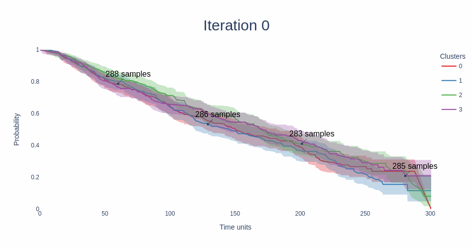
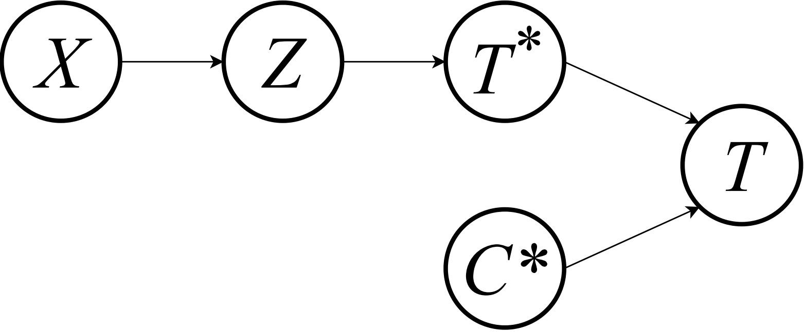
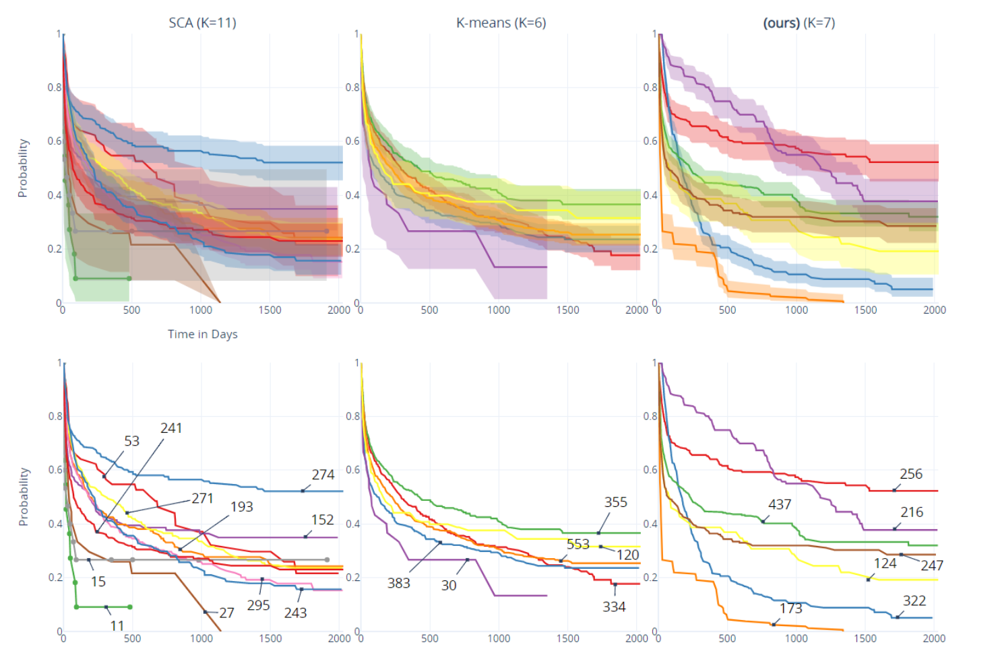

# SurvMixClust

This repository contains the code for the model present in the paper X. It structures its use using the functions fit, predict and training similar to scikit-learn API.

```latex
<to do: reference for article>
```
 
## Model

SurvMix Clust is a finite mixture of nonparametric distributions, using the features to model the mixture proportions with a multinomial logistic regression. In other words, it's a mixture of experts with a gating network for the right-censored time-to-event clusterization problem. It's trained via maximum likelihood with a variety of the Expectation-Maximization (EM) algorithm. Experimental evidence presented shows that our proposal generates competitive predictive performance, sharply different and informative clusters, and interpretable results.



<!--  -->




## Prerequisites
The code is implemented with the following dependencies:
- The R package [survPresmooth](https://cran.r-project.org/web/packages/survPresmooth/index.html) (version 1.1.11) needs to installed. Then, rpy2 package is used to communicate with this package from inside python.

- Create a conda environment with python=3.7.
```sh
conda create -n env_for_SurvMixClust python=3.7
```
- Then, install the requirements with pip.
```sh
pip install -r requirements.txt
```

## Data
We consider the following datasets:

- [SUPPORT](http://biostat.mc.vanderbilt.edu/wiki/Main/DataSets)
- [Flchain](https://vincentarelbundock.github.io/Rdatasets/doc/survival/flchain.html)
- [METABRIC](https://pubmed.ncbi.nlm.nih.gov/22522925/)
- [GBSG](https://pubmed.ncbi.nlm.nih.gov/10676647/)
- [WHAS500](https://www.wiley.com/en-us/Applied+Survival+Analysis%3A+Regression+Modeling+of+Time+to+Event+Data%2C+2nd+Edition-p-9780471754992)

## Model Training

Please check the model_use.ipynb for a example of training and model use.


## Acknowledgments
